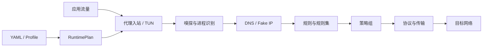

<section class="wuther-hero" markdown>

WUTHERCORE / RUST NETWORK KERNEL

# 一颗内核， 连接每个平台

WutherCore 将代理协议、DNS、规则分流、透明接管、订阅更新和运行观测组合为
可裁剪的 Rust 内核，面向桌面、服务器、路由器与 Android。

[快速开始](getting-started.md){ .md-button .md-button--primary }
[查看功能矩阵](FEATURES.md){ .md-button }
[下载 v0.3.1](https://github.com/MiChongs/WutherCore/releases/tag/v0.3.1){ .md-button }

  STABLE 0.3.1
  RUST 1.88+
  MIT
  10 TARGETS

RUNTIME PIPELINEWC/031

<b>01</b>CAPTURE<small>TUN / MIXED / REDIRECT</small>

<b>02</b>RESOLVE<small>DNS / FAKE IP / PROCESS</small>

<b>03</b>ROUTE<small>RULESET / POLICY / SMART</small>

<b>04</b>TRANSPORT<small>TCP / QUIC / H3 / WG</small>

BUILD<code>--features "portable"</code>

</section>

## 从配置到网络的数据路径

-   :material-tune-variant:{ .lg .middle } **按组件裁剪**

    ---

    使用 Cargo features 像 Go `-tags` 一样选择协议、传输、API 与系统接管。
    `portable`、`portable_boringssl`、`standard` 和精确标签均可用于本地及 CI。

    [组件化构建](BUILDING.md)

-   :material-routes:{ .lg .middle } **跨平台透明接管**

    ---

    覆盖 Linux TUN/TPROXY/REDIRECT、Windows Wintun、macOS TUN 与 Android
    VpnService/root，包含路由、防火墙、回滚和回环保护。

    [流量接管](LINUX-TUN-AUTO-REDIRECT.md)

-   :material-transit-connection-variant:{ .lg .middle } **现代协议与传输**

    ---

    支持 Shadowsocks、VLESS、VMess、Trojan、AnyTLS、Hysteria、TUIC、
    WireGuard、Young、XHTTP、gRPC、uTLS 与更多组合。

    [协议概览](protocols/index.md)

-   :material-chart-timeline-variant-shimmer:{ .lg .middle } **可观测运行时**

    ---

    原生 `/v1` API 和 Clash/Mihomo 兼容 API 提供连接、流量、日志、节点、
    策略组、规则集和运行能力查询。

    [管理 API](API.md)

## 选择你的入口

=== "第一次运行"

    直接下载已经过证明的跨平台归档，复制示例配置，先执行 `check` 再启动。

    [安装与运行](getting-started.md){ .md-button .md-button--primary }

=== "配置与迁移"

    了解 Profile、监听器、节点、订阅、策略组、路由、DNS 和系统接管字段。

    [配置指南](CONFIGURATION.md){ .md-button .md-button--primary }

=== "集成内核"

    从 workspace 边界、RuntimePlan、连接数据流和扩展点开始阅读。

    [架构说明](ARCHITECTURE.md){ .md-button .md-button--primary }

=== "参与开发"

    获取开发基线、提交规范、Review 标准和项目治理说明。

    [参与贡献](project/contributing.md){ .md-button .md-button--primary }

!!! info "文档与代码同仓维护"

    本站由仓库中的 Markdown 通过 MkDocs Material 构建。每次合入 `main` 都会执行
    严格链接验证并通过 GitHub Actions 发布到 GitHub Pages。
