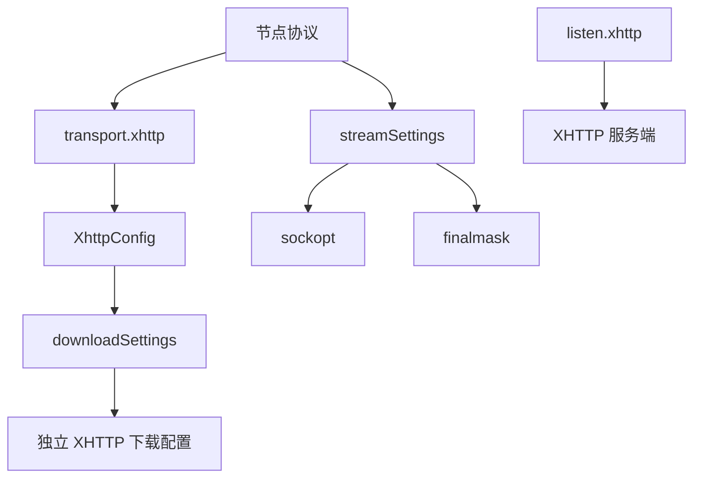

# XHTTP 与 StreamSettings

XHTTP 是节点传输层，也可以作为服务端监听。`streamSettings` 是更底层的 socket
和 FinalMask 策略。两者都保持 Xray 兼容字段名，并由强类型模型拒绝未知字段。

完整索引分为两页：

- [XHTTP 字段索引](generated/xhttp.md)
- [StreamSettings 字段索引](generated/stream.md)

## 配置层次



节点协议负责认证和目标语义，XHTTP 负责 HTTP 承载，TLS 或 REALITY 负责安全层，
StreamSettings 负责出站 socket 和最终掩码。不要把这些字段放到错误层级。

## 客户端 XHTTP

```yaml
nodes:
  - name: edge
    protocol: vless
    address: edge.example.com:443
    login:
      uuid: 00000000-0000-0000-0000-000000000000
    secure:
      tls: true
      tls-settings:
        serverName: edge.example.com
        alpn: [h2]
    transport:
      kind: xhttp
      xhttp:
        host: edge.example.com
        path: /api
        mode: packet-up
        xPaddingBytes: 100-1000
        xmux:
          maxConcurrency: 8-16
```

`transport.kind` 使用 `xhttp`。`splithttp` 是兼容别名。节点协议还需要对应的编译
组件，XHTTP 本身要求 `with_xhttp`。

### 基础字段

| 字段组 | 字段 | 作用 |
| --- | --- | --- |
| 目标识别 | `host`、`path`、`headers` | 构造 HTTP 请求与服务端路径 |
| 模式 | `mode` | 选择单流、流式上行或分包上行 |
| 填充 | `xPaddingBytes` 及相关字段 | 控制填充范围、位置、方法和密钥 |
| 上行 | `uplinkHTTPMethod`、`uplinkDataPlacement`、`uplinkChunkSize` | 控制上传请求 |
| 下行 | `downloadSettings` | 配置独立下载端点 |
| 复用 | `xmux` | 限制并发、连接数和连接寿命 |
| 扩展 | `extra` | 保存协议允许的附加 JSON |

标准字段使用 Xray camelCase 写法。模型还接受记录在逐字段索引中的 kebab-case 和
snake_case 别名，新配置应使用标准字段。

### 模式

| 模式 | 行为 | 独立下载 |
| --- | --- | --- |
| `stream-one` | 上下行使用一个流 | 不允许 |
| `stream-up` | 上行使用流式请求 | 允许 |
| `packet-up` | 上行拆分成请求包 | 允许 |
| `auto` | 按协商和配置选择 | 由最终模式决定 |

独立 `downloadSettings` 可以覆盖地址、端口、TLS、REALITY、socket 和下载侧 XHTTP
配置。它是完整的第二条连接路径，证书名、ALPN、目标和代理链都要单独检查。

### HTTP 版本

| ALPN | HTTP 路径 | 条件 |
| --- | --- | --- |
| `http/1.1` | H1 | TCP，可使用 TLS |
| `h2` | H2 | TCP TLS 或允许的 REALITY 路径 |
| `h3` | H3 | QUIC，必须启用 TLS |

客户端和服务端的 ALPN 必须有交集。配置 H3 时还要编译 `with_quic`。

## XMUX

`xmux` 控制逻辑会话如何复用到物理连接。常用字段族：

| 目标 | 字段 |
| --- | --- |
| 并发 | `maxConcurrency` |
| 连接数量 | `maxConnections` |
| 连接寿命 | `cMaxReuseTimes`、`cMaxLifetimeMs` |
| 请求数量 | `hMaxRequestTimes` |
| 保活 | `hKeepAlivePeriod` |

范围字段可接受整数或 `"左值-右值"`。较高并发会减少连接建立开销，也会放大单连接
故障和服务端资源占用。应同时设置服务端连接、HTTP 流和 relay 上限。

## 服务端监听

```yaml
listen:
  xhttp:
    address: 0.0.0.0
    port: 443
    alpn: [h2, http/1.1, h3]
    tls:
      certificates:
        - certificateFile: /etc/wuther/fullchain.pem
          keyFile: /etc/wuther/private.key
          usage: encipherment
      minVersion: "1.2"
      maxVersion: "1.3"
      rejectUnknownSni: true
    target:
      host: 127.0.0.1
      port: 10000
    max-active-connections: 4096
    max-concurrent-streams: 128
    max-active-http-streams: 4096
    http-idle-timeout: 90s
    settings:
      path: /api
      mode: auto
```

`listen.xhttp` 接受一个对象或对象列表。主要字段分为：

- 地址和协议：`address`、`port`、`alpn`、`tls`
- 转发目标：`target`
- XHTTP 行为：`settings`
- 入口队列：`accept-queue`
- relay 上限：`max-active-relays`
- 连接上限：`max-active-connections`
- H2 流上限：`max-concurrent-streams`
- HTTP 活动流上限：`max-active-http-streams`
- 空闲回收：`http-idle-timeout`

没有 `target` 时只应使用明确支持的本机安全场景。非回环裸转发需要显式
`allow-unauthenticated-non-loopback`，生产环境仍应在目标协议层配置认证。

## TLS 与 REALITY 下载通道

`XhttpDownloadTlsSettings` 负责证书名、ALPN、指纹、证书固定、ECH 和客户端证书。
`XhttpDownloadRealitySettings` 负责 REALITY 公钥、短 ID、指纹、SpiderX 和握手限制。
两类安全层的字段名、别名与默认规则均在
[XHTTP 字段索引](generated/xhttp.md#xhttpdownloadtlssettings)。

安全原则：

1. 证书校验关闭只用于隔离测试。
2. `serverName` 必须与远端证书或 REALITY 配置一致。
3. 证书固定值更新需要与证书轮换同步。
4. 客户端私钥、PSK 和认证 token 不应提交到仓库。
5. 下载通道使用独立地址时，需要单独完成安全校验。

## 下载 socket

`downloadSettings.sockopt` 提供 mark、TFO、MPTCP、接口绑定、域名策略、拨号代理、
Happy Eyeballs 和自定义 socket option。字段分组：

| 类别 | 字段示例 |
| --- | --- |
| 路由 | `mark`、`interface`、`dialerProxy` |
| TCP | `tcpFastOpen`、`tcpKeepAliveIdle`、`tcpKeepAliveInterval`、`tcpCongestion` |
| 地址解析 | `domainStrategy`、`addressPortStrategy` |
| 双栈竞速 | `happyEyeballs` |
| Linux 透明代理 | `tproxy` |
| 高级 option | `customSockopt` |

操作系统不支持的 socket option 会按实现能力处理。生产配置应避免依赖未在目标平台
验证的自定义 option。

## 节点 StreamSettings

```yaml
nodes:
  - name: edge
    protocol: vless
    address: edge.example.com:443
    login:
      uuid: 00000000-0000-0000-0000-000000000000
    streamSettings:
      network: tcp
      sockopt:
        mark: 0
        tcpFastOpen: true
        domainStrategy: UseIP
        happyEyeballs:
          prioritizeIPv6: false
          interleave: 1
          tryDelayMs: 250
          maxConcurrentTry: 4
```

顶层字段只有 `network`、`sockopt` 和 `finalmask`。`sockopt` 的部分 Xray 入站字段为
导入兼容而保留，在出站 socket 上会明确忽略。逐字段索引会标出这些字段。

### 域名策略

`domainStrategy` 支持 `AsIs`、`UseIP`、`UseIPv4`、`UseIPv6`、双栈顺序变体及
相应的 `Force` 变体。`Use` 允许解析后使用地址，`Force` 要求得到符合地址族条件
的结果，否则连接失败。

`addressPortStrategy` 支持 `none`、SRV 和 TXT 的端口、地址或组合查找。只有在 DNS
数据和运行时路径都支持时才有实际效果。

### Happy Eyeballs

| 字段 | 类型 | 默认值 |
| --- | --- | --- |
| `prioritizeIPv6` | 布尔值 | `false` |
| `interleave` | 非负整数 | `1` |
| `tryDelayMs` | 毫秒 | `0` |
| `maxConcurrentTry` | 非负整数 | `4` |

低延迟不等于零延迟最优。双栈网络质量不稳定时，给首选地址族一个小的领先窗口可以
减少无效并发。

## FinalMask

`finalmask` 在协议和传输处理之后应用：

| 方向 | 类型 |
| --- | --- |
| TCP | `header-custom`、`fragment`、`sudoku`、`xmc` |
| UDP | `header-custom`、`mkcp-legacy`、`noise`、`salamander`、`sudoku`、`xdns`、`xicmp`、`realm` |
| QUIC | `quicParams` |

每个 item 使用带 `type` 的对象，具体 `settings` 由对应类型决定。FinalMask 会改变
线上字节序列，客户端和服务端必须使用兼容配置。需要与 Xray 逐包验证时，使用
[FinalMask 验证手册](../finalmask-xray-oracle.md)。

## 校验

```bash
wuther-core components
wuther-core check config.yaml
wuther-core explain config.yaml
```

重点确认 `with_xhttp`、`with_http_transport`、`with_quic`、`with_reality` 和节点协议
组件是否包含在二进制中。完整客户端与服务端说明另见
[XHTTP / SplitHTTP](../XHTTP.md)。
